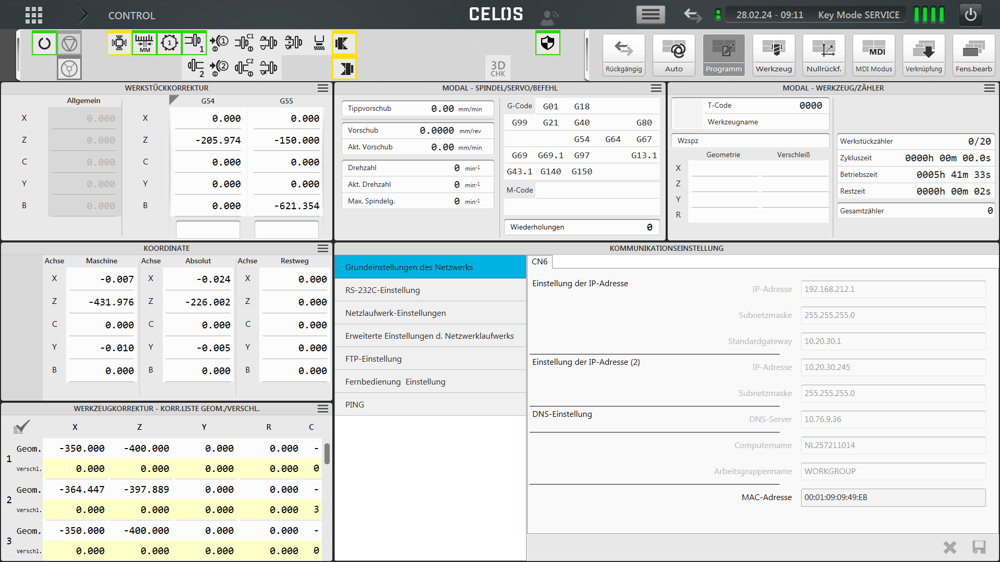

# Guide to use Ethernet/IP connection with DMG MORI CNC machines
This guide is intended to be used with machines equipped with Ethernet/IP scanner robot interface option.
UR robot implements Ethernet/IP adapter functionality.

Provided scripts show examples for configuring connection and communicating with NLX 2500 machine. 
Other machines with similar controller should work as well, but the configuration may differ.

## Prerequisites
### Polyscope 5.17.0 or later
Before starting program Ethernet/IP adapter needs to be enabled in Polyscope.
Watchdog setting should be set to "NONE". This setting is only used for default UR Ethernet/IP assembly.

<picture>
  
</picture>

### Polyscope X 10.8.0 or later
Before starting program Ethernet/IP service needs to be enabled in Polyscope.

<picture>
  
</picture>

Watchdog setting should be set to "IGNORE". This setting is only used for default UR Ethernet/IP assembly.

<picture>
    
</picture>

## Flexible Ethernet/IP Adapter configuration on the robot
Default Adapter configuration on the robot is not compatible with DMG MORI machines.

First script needs to create new input and output assemblies and set the correct size.
Example URScript function setting 8 byte input assembly (101) and 8 byte output assembly (111):
```python
def dmgmori_register_connection(robot_to_cnc = 111, cnc_to_robot = 101, size = 8):
  # connect to internal XMLRPC service (do not change address)
  local eip_configurator = rpc_factory("xmlrpc", "http://127.0.0.1:40000/RPC2")

  # create new input and output assembly
  if(not eip_configurator.add_configuration(robot_to_cnc, size, cnc_to_robot, size)):
    popup("Adding CNC instances failed")
    halt
  end
  eip_configurator.closeXMLRPCClientConnection()

  # wait for restart of the adapter
  sleep(1.0)
end
```

Next step is to configure individual input and output connections. This is done by ```dmgmori_init_eip_communication()``` function.

## DMG MORI Ethernet/IP scanner configuration
This is not exhaustive guide, but it should help you get started.

1. Configure network settings.

<picture>
  
</picture>

2. Configure Ethernet/IP scanner settings.

<picture>
  
</picture>

3. Configure Ethernet/IP input and output data ranges.

<picture>
  
  
</picture>

## Resources
### URScript libraries for a robot
Simplified library with minimal functionality: [dmgmori_simple.script](resources/dmgmori_simple.script)

Broader library with support for Robot Request M-Codes: [dmgmore_full.script](resources/dmgmori_full.script)


### Example robot programs
Example program that configures communication, and controls main door of the machine:
[dmg-mori-door-control.urp](resources/dmg-mori-door-control.urp)

<picture>
  
</picture>

More advanced example that configures communication, and also starts machining cycle:
[dmg-mori-robot-control.urp](resources/dmg-mori-robot-control.urp) 

Download programs to the usb drive, and import them in Polyscope.

## Troubleshooting
PING command from DMG MORE can be used to test connection to the robot.
If it fails, check the following:
- Check if IP address on the robot, and on the machine are configured correctly.
- Check if security settings on the robot are set to allow communication with the machine.

Ethernet/IP scanner on the machine shows error:
- Run robot program to reconfigure Ethernet/IP adapter on the robot. It needs to be done at least once after the robot is powered on.
- Check if input, and output insteances are configured correctly on the machine and on the robot. Pay attention to instance numbers, and direction of communication (input/output).