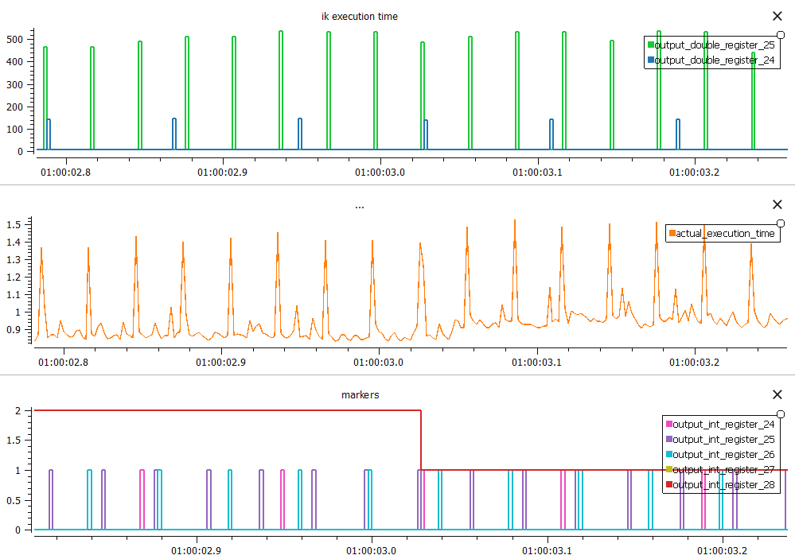

# Execution time
This examples show how to measure execution time of URScript code.
Example programs were created in Polyscope 5, but presented URScript code can be also used on Polyscope X.

Requirements: Polyscope 5.22, Python 3.10

Execution time data is exported through RTDE General Purpose (GP) registers. Register values can be exported to csv file for later analysis.

Here is an example for included program:

- Upper graph shows execution time of 2 different sections (expensive ik, and cheap ik) - each executing 5 inverse kinematic calculations in a row in microseconds.
- Middle graph shows total execution time used by controller in milliseconds.
- Lower graph shows markers when individual parts of code from different threads were actually executed.

## Marking code execution
Example is using GP integer registers to mark how many times selected code was executed in single realtime cycle.

## Measuring real execution time
Example is using time() function together with GP floating point registers to measure real time it took to execute section of script code.

# Getting started using robot simulator
Examples can be easily tried out without real UR robot (but timing will be very much different than on real robot).

Universal-Robots provides [dockerized simulator images](https://hub.docker.com/r/universalrobots/ursim_e-series).
Simulator includes modbus client functionality. Follow instructions on dockerhub to download simulator image.

**NOTE:** It's recommended to use UltraVNC Viewer (Windows) or Remmina (Linux) to interact with Polyscope GUI instead of using http VNC interface.

By default when simulator is started no external files can be accessed. Following command starts URSim mapping current folder into subfolder to programs in URSim:

```bash
# Linux
docker run -dit --rm -p 5900:5900 -p 30004:30004 -v ./:/ursim/programs/execution-time --name ursim universalrobots/ursim_e-series

# Windows
docker run -dit --rm -p 5900:5900 -p 30004:30004 -v "$(PWD):/ursim/programs/execution-time" --name ursim universalrobots/ursim_e-series
```

## Collecting data using RTDE recorder
```python
# create virtual environment
python -m venv venv
source venv/bin/activate  # Linux
# or venv\Scripts\activate  # Windows
# install requirements
pip install -r requirements.txt
# start RTDE recorder
python record.py --host localhost --frequency 500 --config debug_rttmb_conf.xml --output debug_time.csv --verbose
```

## Analyzing data
Data can be analyzed using [plotjuggler](https://plotjuggler.io/).

# Contributing

Create pull request if there is any example that was tested, and should be included.
