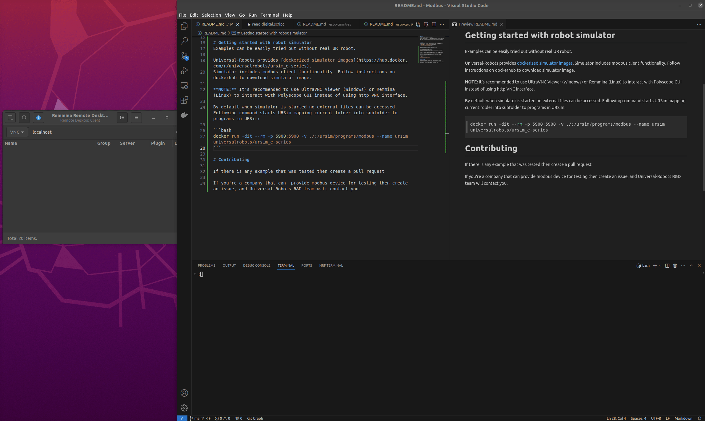
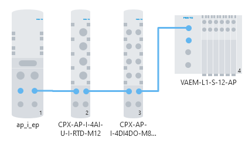

# Control Festo CPX Modbus IO bridge

Examples require [Universal-Robots software 5.14.0](https://www.universal-robots.com/articles/ur/release-notes/release-note-software-version-514xx/) or later.

Efficient control of inputs and outputs of I/O modules connected to Modbus bridge.
Basic error handling routines are implemented.

# Getting started

There are two components:
- festo_io_library.script - library of utility script functions
- festo_cpx_example.urp - example program that uses library functions to toggle outputs, and read inputs.

Both files should be uploaded to the robot.

## Testing with robot simulator
IO bridge should be connected to the network and configured.
Dockerized URSim 5.14 image is used to run a program.
<picture>
 
</picture>

# Hardware setup

<picture>
 
</picture>

# Accessing I/O
## Digital I/O and pneumatic valves

Output coils are mapped to:

    bits 0-4 - digital outputs of CPX-AP-I-4DI4DO-M8-3P
    bits 8-32 - pneumatic valves in VAEM-L1-S-12-AP

Input coils are mapped to:

    bits 0-4 - digital inputs of CPX-AP-I-4DI4DO-M8-3P

Library is setting up 2 signals CPX_DO with 32 digital outputs, and CPX_DI with 4 digital inputs to handle all 24 valves and 8 digital inputs/outputs.

Both signals are exchanging data cyclically at default rate of 10Hz.

Helper function `festo_set_output_coil(number, state)` allows to toggle individual output coils and `festo_get_input_coil(number)` reads the state of one of 4 input coils.

## Analog inputs

4 analog Inputs from module CPX-AP-I-4AI-U-I-RTD-M12 are mapped to holding registers 5000-5003.

Library is using 1 signal CPX_RTDI to handle all 4 analog temperature inputs. Analog inputs are cyclically polled with default frequency 10Hz.

Individual input values can be read in the program using `festo_get_analog_in(number)` with zero-based input index.

# Bridge, and I/O modules configuration

IP address should be configured, and Modbus protocol enabled.
Configuring Festo modules is beyond the scope of this example.